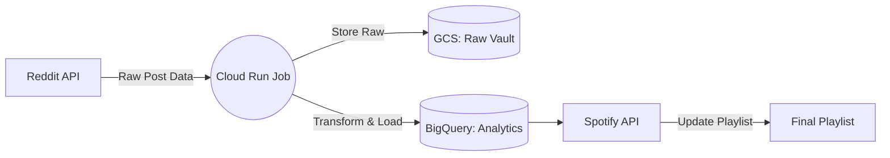

# spotipunk 🤘
This is a data pipeline that extracts songs from the reddit forum r/poppunkers and then sends those song titles to Spotify to build a playlist. 
---
# SpotiPunk Pipeline Architecture

The **SpotiPunk Pipeline** was developed to build off the active pop punk community and discover (sometimes re-discover) music on Reddit. These songs are shared as a public playlist on Spotify. This pipeline runs serverlessly on Google Cloud Platform (GCP) to find the top songs mentioned throughout the week and add it to a rolling monthly playlist.

## 1. High-Level Architecture

The system utilizes a modular, serverless approach, ensuring zero operational overhead when the pipeline is idle.

## 2. Data Flow

1. **Ingestion:** A scheduled Cloud Run Job fetches trending song discussions from the `poppunkers` subreddit.
2. **Storage:** Raw JSON metadata is archived in **Google Cloud Storage (GCS)** for historical auditing.
3. **Processing:** Data is parsed, and track IDs are extracted and validated.
4. **Transformation:** Validated tracks are pushed to **BigQuery** for long-term analytics on song popularity.
5. **Synchronization:** The pipeline interacts with the **Spotify API** to sync the official curated playlist with the processed track list.

---

## 3. Component Breakdown

### Cloud Scheduler (The Orchestrator)

The "heartbeat" of the project. It triggers the pipeline every Friday afternoon using a CRON expression, ensuring the Spotify playlist is updated right before the weekend. Gotta make sure it's updated before the Friday drive home from work.

### Cloud Run Jobs (The Engine)

A containerized Python environment that executes the core logic. Cloud Run was chosen for its ability to scale to zero (no cost when idle) and its ability to seamlessly inject secrets directly from Secret Manager at runtime. The only drawback is the relatively long cold-start time to boot up.

### Secret Manager (The Vault)

Manages sensitive API credentials (Reddit Client IDs, Spotify Refresh Tokens). By using Secret Manager, no sensitive keys are ever hardcoded in the repository or container image.

### Cloud Storage (The Archive)

Acts as the "Raw Vault." It stores the raw JSON responses from Reddit, providing a fallback layer if the pipeline needs to be re-run or backfilled for historical data analysis.

### BigQuery (The Analytics Warehouse)

The final destination for processed track data. It enables SQL-based analysis to correlate subreddit discussion volume with track performance over time.

---

## 4. Security & Authentication

* **Service Accounts:** The pipeline operates under a least-privilege `spotipunk-runner` service account. This account has specific, restricted access to interact only with the necessary GCS buckets, BigQuery tables, and Secret Manager keys.
* **OAuth 2.0:** Spotify authentication is handled via a secure Refresh Token exchange, bypassing the need for interactive browser sessions, making it fully compatible with headless serverless execution.

---

### Service Relationship & Diagram

